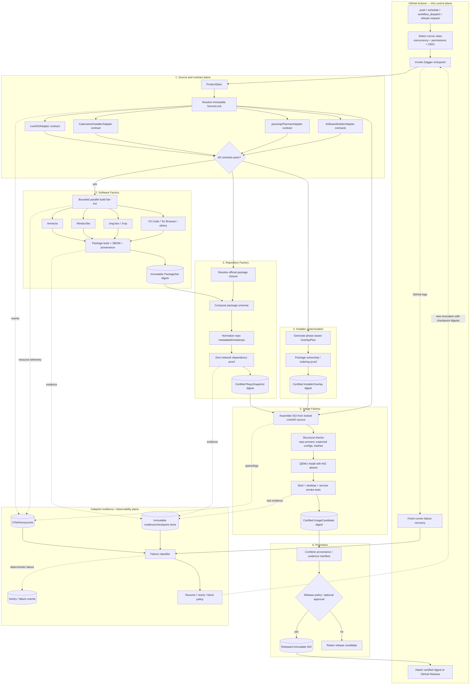

# Candidate 07 — Recommended Hybrid Architecture

## Executive summary

This is the recommended final architecture. It combines:

- **Dagger-first execution** for local/CI parity;
- **Software Factory / Image Factory separation** for failure isolation;
- **content-addressed immutable promotion** for resumability and reproducibility;
- **contract-certified upstream adapters** for CachyOS/Calamares/pacstrap drift;
- **classified recovery and out-of-band observability** for runner failures;
- an optional **variant planner** above the stable core for future editions.

GitHub Actions becomes a control and trust boundary, not the build system.

## Final flowchart



## Why this is the recommended architecture

The observed failures came from different layers and therefore need different architectural responses:

- runner termination is an **execution resilience** problem;
- rebuilding Amnezia after ISO defects is a **boundary/checkpoint** problem;
- future repository metadata timestamps are an **artifact normalization** problem;
- moving upstream branches are a **source-lock** problem;
- `pacstrap` host/target semantics are an **adapter contract** problem;
- Calamares-owned-file collision is an **overlay ordering/ownership** problem;
- stale assertions after changing staging layout are an **invariant ownership** problem.

A single mechanism cannot solve all of these. The hybrid assigns each failure class to the layer that can actually contain it.

## Module architecture

Suggested Dagger package/module boundaries:

```text
pipeline/
  product/       # ProductSpec and optional variant planner
  sources/       # SourceLock, fetch, provenance
  adapters/
    cachyos/
    calamares/
    pacstrap/
    software/
  software/      # builders and native package production
  packages/      # official closure resolution
  repo/          # repository assembly/normalization/certification
  installer/     # OverlayPlan and overlay artifact
  image/         # ISO assembly and structural certification
  vmtest/        # no-NIC install/boot/smoke tests
  artifacts/     # CAS/OCI references, manifests, promotion
  o11y/          # event schema, spans, evidence emission
  recovery/      # failure classifier and retry recommendation
  release/       # final policy and release manifest
```

This is a conceptual layout, not a requirement to create exactly these directories.

## Canonical internal artifact types

### `SourceLock`

Pins every moving input once. It should include CachyOS Live ISO commit, Calamares commit/package version, application source tags/commits, fetched binary digests where source build is not used, toolchain image digests, and product spec digest.

### `SoftwarePackageSet`

A manifest plus immutable package payloads. Each member records upstream source, build recipe, resource policy, tests, SBOM and digest.

### `RepoSnapshot`

A self-contained package repository with indexes, normalized metadata, package manifest and no-network-resolution evidence.

### `InstallerOverlay`

A declarative set of changes with **application phase** and ownership assumptions. Example phases:

```text
pre-upstream-package-install
post-upstream-package-install
pre-image-finalize
runtime-before-installer
```

The Calamares overrides that previously collided belong in an appropriate post-package-install phase.

### `ImageCandidate`

ISO plus hashes, exact dependency artifact digests and structural test results.

### `CertificationEvidence`

Machine-readable records for package tests, repository proof, installer contracts, QEMU no-NIC install, boot/smoke tests and failure classification.

## GitHub Actions architecture

A healthy end state has very little YAML. Conceptually:

```text
workflow: validate
  checkout thin repository metadata
  authenticate artifact store
  dagger call validate --github-context=...

workflow: build-release-candidate
  choose runner class
  authenticate artifact store
  dagger call release-candidate --spec=...
  upload emergency summary/reference

workflow: recover-failure
  always/failure trigger on fresh runner
  collect GitHub logs + o11y + checkpoint evidence
  dagger call classify-failure --run=...

workflow: release
  protected-environment approval
  dagger call promote --candidate=sha256:...
  create GitHub Release pointing at immutable result
```

GitHub should not contain package lists, pacman commands, Calamares edits, build-system patches, or ISO assembly ordering.

## Checkpoint policy

Recommended durable checkpoints:

1. `SourceLock`
2. each expensive `SoftwarePackage`
3. `SoftwarePackageSet`
4. `RepoSnapshot`
5. `InstallerOverlay`
6. raw `ImageCandidate`
7. `CertifiedImageCandidate`

Do **not** checkpoint every tiny transformation. Checkpoint where recomputation is expensive or where an artifact is independently meaningful.

## Retry policy

### Automatically resumable

- hosted runner shutdown;
- transient fetch failure before source lock finalization;
- disk exhaustion if a larger runner/storage class is available;
- OOM when the retry can reduce concurrency or move to a larger runner.

### Fail closed without automatic retry

- source lock changed unexpectedly;
- package ownership contract changed;
- offline dependency proof failed;
- adapter semantics changed;
- deterministic package/unit/integration test failure;
- no-NIC installation or boot certification failure.

This prevents a “resilient” pipeline from becoming a loop that merely retries bugs.

## Observability model

Every Dagger function should emit a structured stage identity and correlation keys:

```text
pipeline_run_id
product_spec_digest
source_lock_digest
stage_name
artifact_input_digests[]
artifact_output_digest
attempt
runner_id/class
cpu_budget
memory_observed
peak_disk_observed
failure_class
```

The fresh recovery runner should be able to reconstruct the last known checkpoint without access to the dead runner's filesystem.

## Reproducibility model

Reproducibility has layers:

1. **Input reproducibility** — every source/toolchain is locked.
2. **Graph reproducibility** — same Dagger code and product spec define ordering.
3. **Artifact reproducibility** — normalized metadata removes accidental timestamp/order noise where practical.
4. **Semantic reproducibility** — adapter contracts prove the tools still implement the behavior the pipeline relies on.
5. **Release reproducibility** — a release manifest names all exact input/output digests.

The architecture should not promise bit-for-bit ISO determinism until it is measured. It can still guarantee exact provenance and semantic equivalence before that.

## Security and trust boundary

Dagger build functions should receive scoped secrets only when required. Prefer GitHub OIDC or short-lived credentials for artifact publishing. Software compilation should not receive release-promotion credentials. Release promotion should consume immutable already-tested artifacts and therefore need no source-build privileges.

This splits the high-trust release step from the high-risk arbitrary-build step.

## Variant strategy

Do not start with a large matrix. Add a `VariantPlanner` only after the first edition is certified. The same factories can then support LXQt/Plasma, NVIDIA/generic, and workload bundles by composing existing package/repository/overlay artifacts.

## Incremental implementation plan

### Phase 1 — establish boundaries

Implement Dagger modules for:

```text
Software Factory
  -> Repo Snapshot
  -> Installer Overlay
  -> Image Assembler
```

Keep current GitHub artifact storage temporarily if necessary.

### Phase 2 — lock and certify upstreams

Add `SourceLock` and executable adapters for CachyOS Live ISO, Calamares and pacstrap. Move brittle source/layout assumptions into these modules.

### Phase 3 — durable immutable promotion

Introduce an OCI/CAS-style artifact store and checkpoint digests. Make GitHub/Dagger caches optional accelerators.

### Phase 4 — no-network end-to-end certification

Add QEMU installation with no NIC, reboot, desktop/service smoke tests, and evidence artifacts.

### Phase 5 — classified recovery

Use the existing o11y/fresh-runner pattern as the seed for a failure classifier. Automate only the retries that are safe.

### Phase 6 — variants and release cohorts

Add variant planning after the core pipeline has a stable release manifest.

## Final justification

This hybrid is more complex than simply translating every current GitHub Actions step into Dagger, but a literal translation would preserve the existing coupling. The architecture should exploit the rewrite to create **stable artifact boundaries and semantic contracts**.

The most important rule is:

> **A successful expensive stage should become an immutable reusable fact, and an upstream behavioral assumption should become an executable contract.**

That rule directly converts the o11y failure history into a pipeline that degrades gracefully, resumes selectively, and remains understandable as the ISO and preinstalled software set grow.
